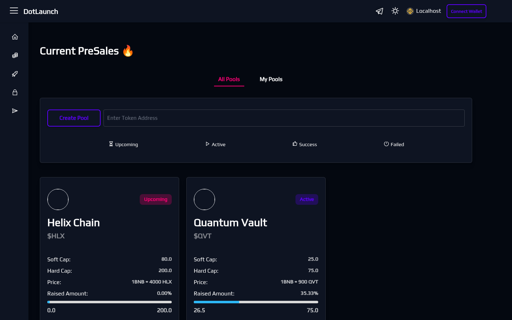
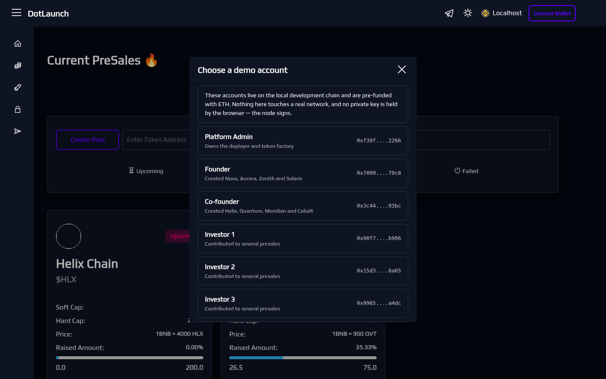

# DotLaunch

A token launchpad platform: teams create presales for their token, investors
contribute during a sale window, and funds or refunds settle on chain when the
window closes. Alongside the presale flow it carries a token factory, a
token/liquidity lock service, and a batch distribution tool.

The whole stack runs offline on a local chain with seeded demo data, and is
usable without a browser wallet extension.

---

## Contents

- [What it does](#what-it-does)
- [Architecture](#architecture)
- [Running it](#running-it)
- [Demo accounts](#demo-accounts)
- [Tests](#tests)
- [Determinism](#determinism)
- [Configuration](#configuration)
- [Repository layout](#repository-layout)
- [Screenshots](#screenshots)

---

## What it does

**Presales.** A project owner creates a sale for an ERC20: soft cap, hard cap,
per-wallet minimum and maximum, a presale rate, a listing rate, and a sale
window. The launchpad contract holds the token allocation, accepts
contributions in the native coin or an ERC20, and enforces the caps and limits
per contribution. When the window closes, contributors claim their tokens if
the sale cleared its soft cap, or reclaim their funds if it did not. Owners can
cancel a sale before it clears its soft cap; after that point contributors have
a reasonable expectation the raise completes, and the contract stops allowing
it.

**Fair launches.** A variant with no soft cap and no per-wallet limits, where
every contributor receives a share of the pool proportional to what they put
in. The deployer rejects a fair launch that tries to set either.

**Whitelisting.** A sale can gate contributions to a granted list, optionally
until a deadline after which it opens to everyone.

**Token factory.** Deploys either a plain ERC20 or a fee-on-transfer
"liquidity" token. Capabilities — mint, burn, pause, blacklist — are chosen at
creation and are then immutable, so a deployer cannot switch minting on after a
raise. Fee-on-transfer tokens have their fees capped and immutable for the same
reason. The factory prices each configuration, charges for it, and refunds
overpayment.

**Locks.** Token and liquidity locks with unlock dates, listed per token and
per owner.

**Multisend.** Atomic batch distribution of an ERC20 to many recipients — the
whole batch settles or none of it does.

---

## Architecture

| Piece | Stack |
| --- | --- |
| Web app | React 17, TypeScript, styled-components, Tailwind, CRA/craco |
| API | Node, Express, MongoDB via Mongoose, Redis (Bull) |
| Contracts | Solidity 0.8.17, Hardhat, OpenZeppelin |
| Chain (local) | Anvil (Foundry) |

The API does not read presale state from the chain on request. A background
listener polls contract logs, translates them into documents, and serves the
catalogue from MongoDB — so listing and filtering stay fast and do not depend
on an RPC round trip per card. Off-chain presale metadata (description, links,
socials) is stored through the API and referenced on chain by URI.

Storage sits behind a `StorageProvider` interface with two drivers: a
filesystem driver (the default, which is what makes the stack runnable with no
external account) and a Pinata/IPFS driver. All third-party storage SDK usage
is confined to that one class.

---

## Running it

Requires Docker with Compose v2. Nothing else — no Node, no MongoDB, no API
keys, no network access at runtime.

```bash
git clone <this-repo>
cd dotlaunch

# Build and start: anvil, mongo, redis, contract deployment, API, web app.
docker compose --env-file .env.docker up --build -d

# Load the demo environment: tokens, presales in every state, locks.
docker compose --env-file .env.docker run --rm seed
```

Then open **http://localhost:3000**.

Startup ordering is enforced with health checks: the contract deployment must
exit cleanly before the API starts, and the API must be healthy before the web
app does. `up` returns when everything is actually ready, not merely started.

Rough timings on a warm Docker cache: build ~4 minutes (the frontend
production build dominates), `up` ~40 seconds, `seed` ~60 seconds.

| Service | URL |
| --- | --- |
| Web app | http://localhost:3000 |
| API | http://localhost:8888/api/v1 |
| Health | http://localhost:8888/api/v1/health |
| Chain (JSON-RPC) | http://localhost:8545 |
| MongoDB | localhost:27018 |

To reset to a clean slate:

```bash
docker compose --env-file .env.docker down -v
```

Ports can be overridden — `WEB_PORT`, `API_PORT`, `ANVIL_PORT`, `MONGO_PORT`
in `.env.docker` — if any collide with something already running.

---

## Demo accounts

The app is wallet-gated, so in a wallet-based app the private key *is* the
credential. **No browser extension is required.** Pick **Connect Wallet →
Demo wallet** and choose an account.

These are the standard accounts of the public Foundry/Hardhat development
mnemonic (`test test test test test test test test test test test junk`).
They are public by design, hold no real funds, and the demo wallet refuses to
run against anything but a local chain. The browser never holds a key — the
local node keeps these accounts unlocked and signs on their behalf.

| Role | Address | Sees |
| --- | --- | --- |
| Platform Admin | `0xf39Fd6e51aad88F6F4ce6aB8827279cffFb92266` | Owns the deployer and token factory |
| Founder | `0x70997970C51812dc3A010C7d01b50e0d17dc79C8` | Created Nova, Aurora, Zenith, Solaris |
| Co-founder | `0x3C44CdDdB6a900fa2b585dd299e03d12FA4293BC` | Created Helix, Quantum, Meridian, Cobalt |
| Investor 1 | `0x90F79bf6EB2c4f870365E785982E1f101E93b906` | Contributions across several sales |
| Investor 4 | `0x976EA74026E726554dB657fA54763abd0C3a0aa9` | Whitelisted for Quantum Vault |

Log in as **Founder** or **Co-founder** to see owner-side views ("My Pools",
sale management). Log in as an **Investor** to see contribution and claim
state.

### What the seed creates

Eight presales, one per state the UI can render:

| Project | State | Raised |
| --- | --- | --- |
| Helix Chain (HLX) | Upcoming — opens in 2 days | 0 / 200 |
| Nova Protocol (NOVA) | Live | 29.45 / 120 |
| Zenith Labs (ZNTH) | Live, fair launch | 23.75 / 50 |
| Quantum Vault (QVT) | Live, whitelist-gated | 26.5 / 75 |
| Aurora Finance (AURA) | Live, at hard cap | 60 / 60 |
| Solaris DAO (SOL8) | Finalised, cleared soft cap | 40 / 40 |
| Meridian (MRDN) | Cancelled, refundable | 9.5 / 100 |
| Cobalt Network (CBLT) | Closed below soft cap | 13.5 / 120 |

Plus 11 tokens (including a fee-on-transfer token) and 5 locks — one already
matured, so the claimable state is visible.

---

## Tests

All suites live under [`tests/`](tests/), split by package.

```bash
# API — unit and integration, against a real MongoDB
docker compose --env-file .env.docker run --rm test

# Contracts
cd contracts && npm install && npx hardhat test

# Web app
cd frontend && npm install && npm test
```

Current state:

```
contracts   130 passing   (5 suites)
backend     157 passing   (10 suites: storage, config, clock, big-number
                           helpers, event decoding, block-range selection,
                           wallet signatures, API integration, campaigns,
                           presale status filtering)
frontend    121 passing   (5 suites)
─────────────────────────────────────────
total       408 passing
```

Lint and type checking:

```bash
cd backend  && npm run lint        # 0 errors
cd frontend && npm run lint        # 0 errors
cd frontend && npm run typecheck   # clean
```

### What the tests cover

They are behavioural, not smoke tests. Representative examples:

- **Contracts** — fee quoting and overpayment refunds; capability flags
  staying disabled for the owner; fee-on-transfer maths matching the on-chain
  quote; batch distribution paying nobody when the approval is short; the full
  presale lifecycle including the rule that a sale cannot be cancelled once it
  has cleared its soft cap.
- **API** — signature-verified sign-in, including rejecting a signature made
  by a different key or over a different message; campaign ownership
  enforcement; presale status bucketing; content-addressed storage including
  path traversal.
- **Web app** — configuration precedence and the application clock; revert
  reason normalisation from the several shapes wallets and ethers throw.

---

## Determinism

The same inputs produce the same screen, which matters for reviewing and for
automated tooling.

- Contract addresses are fixed. A clean chain, the fixed development mnemonic,
  and a fixed deployment order always produce the same addresses — they are
  written into `.env.docker` and asserted at deploy time.
- The chain starts at a pinned genesis and mines on demand rather than on a
  timer, so its clock only advances when something happens.
- The API and the web app both treat `FIXED_NOW` (`2025-06-15T12:00:00Z`) as
  the present. The seeder replays 45 days of history — running and closing the
  past sales at their real times — and parks the chain clock exactly on that
  instant, so on-chain state, indexed data and rendered countdowns all agree.

Leave `FIXED_NOW` unset and every clock follows real time, which is what a real
deployment does.

---

## Configuration

Every setting is read from the environment; see [`.env.example`](.env.example)
for the full list and [`.env.docker`](.env.docker) for the values Compose uses.
Nothing sensitive is committed — the values in those files are local
development defaults.

Notable settings:

| Variable | Purpose |
| --- | --- |
| `CHAIN_RPC_URL`, `CHAIN_ID` | Which chain to talk to |
| `STORAGE_DRIVER` | `local` (filesystem) or `pinata` (IPFS) |
| `DEMO_MODE` | Offers the built-in demo wallet. Never enable against a live network |
| `FIXED_NOW` | Pins the application clock. Empty means follow real time |
| `JWT_SECRET` | Required in production; startup refuses the development default |

Contract addresses are discovered from the deployment record the deploy script
writes, so they do not have to be copied by hand; environment variables
override it when set.

---

## Repository layout

```
contracts/     Solidity sources, deployment and seed scripts
backend/       Express API, event listener, storage providers
frontend/      React application
tests/         All suites: tests/backend, tests/contracts, tests/frontend
docs/          Screenshots
```

Third-party code vendored into the tree is recorded in
[THIRD_PARTY_NOTICES.md](THIRD_PARTY_NOTICES.md).

---

## Screenshots

In [`docs/screenshots/`](docs/screenshots/) — the catalogue and each status
filter, presale detail pages for live, filled, whitelisted, upcoming,
finalised and cancelled sales, the creation wizards, token and lock
management, multisend, the demo wallet account picker, and mobile viewports.




